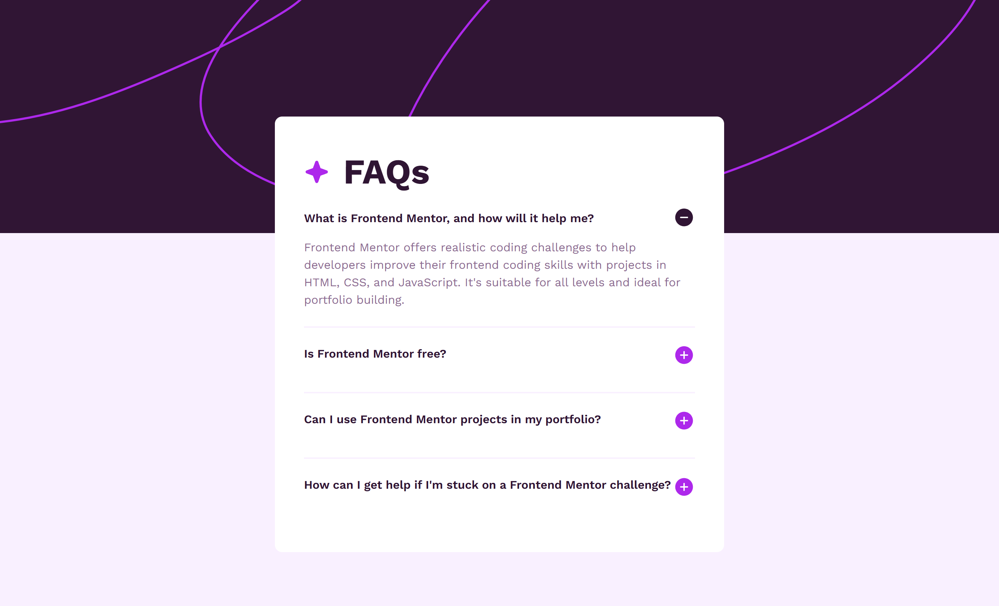

# Frontend Mentor - FAQ accordion solution

This is a solution to the [FAQ accordion challenge on Frontend Mentor](https://www.frontendmentor.io/challenges/faq-accordion-wyfFdeBwBz). Frontend Mentor challenges help you improve your coding skills by building realistic projects.

## Table of contents

- [Overview](#overview)
  - [The challenge](#the-challenge)
  - [Screenshot](#screenshot)
  - [Links](#links)
- [My process](#my-process)
  - [Built with](#built-with)
  - [What I learned](#what-i-learned)
  - [Useful resources](#useful-resources)
- [Author](#author)

## Overview

### The challenge

Users should be able to:

- Hide/Show the answer to a question when the question is clicked
- Navigate the questions and hide/show answers using keyboard navigation alone
- View the optimal layout for the interface depending on their device's screen size
- See hover and focus states for all interactive elements on the page

### Screenshot

### Links

[Live Site URL](https://kapteynuniverse.github.io/FAQ-accordion/)

[Solution URL](https://www.frontendmentor.io/solutions/third-challenge-faq-accordion-9ws5D-hHhb)

## My process

### Built with

- Semantic HTML5 markup
- CSS custom properties

### What I learned

While building this project, I improved my understanding of:

- The Details disclosure element : I learned how to use the semantic `
` element to create accessible expandable sections without relying on JavaScript. It provides built-in functionality for toggling content visibility and works well for components like FAQs or collapsible information panels.
- The Picture element : I gained a better understanding of the <picture> element for responsive images. By combining `<source>` element with different media conditions, it allows the browser to select the most appropriate image depending on the device screen size or resolution.
- Interpolate-size : I learned about the interpolate-size CSS property and how it can help animate elements with intrinsic sizes, such as those inside a `
` element. This makes it possible to create smoother expand/collapse animations when content height changes dynamically.

### Useful resources

- [Details element](https://developer.mozilla.org/en-US/docs/Web/HTML/Reference/Elements/details) : Helped me understand how to use the built-in HTML disclosure widget for expandable content.
- [Picture element](https://developer.mozilla.org/en-US/docs/Web/HTML/Reference/Elements/picture) : Explained how to implement responsive images using different sources.
- [Kevin Powell](https://www.youtube.com/@KevinPowell/) : Great resource for learning modern CSS techniques and improving frontend development skills.
- [Animating details element](https://www.youtube.com/watch?v=Vzj3jSUbMtI) : Demonstrates how to create smooth animations for expandable content.

## Author

- Frontend Mentor - [Asilcan Toper](https://www.frontendmentor.io/profile/KapteynUniverse)
